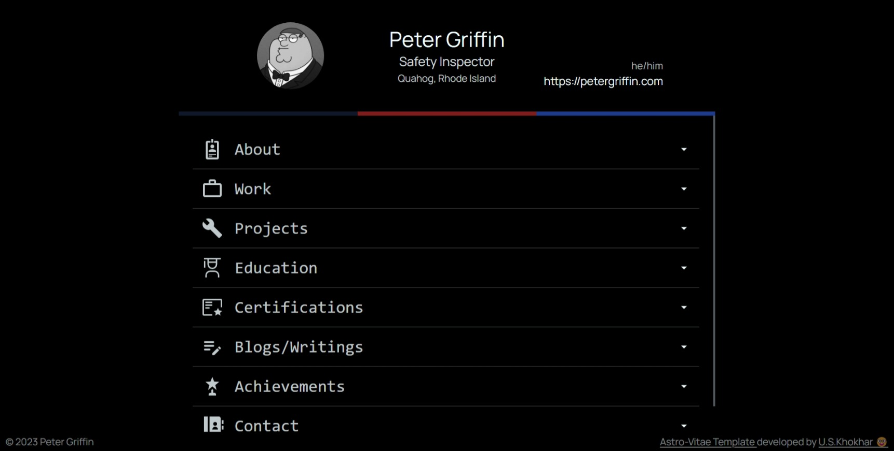
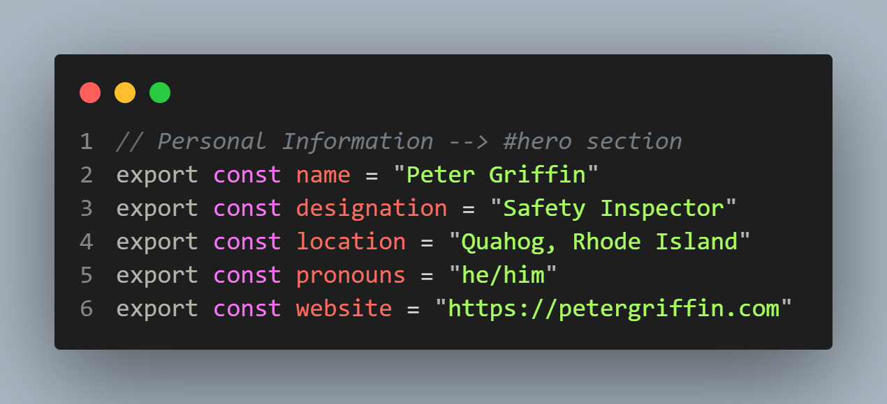
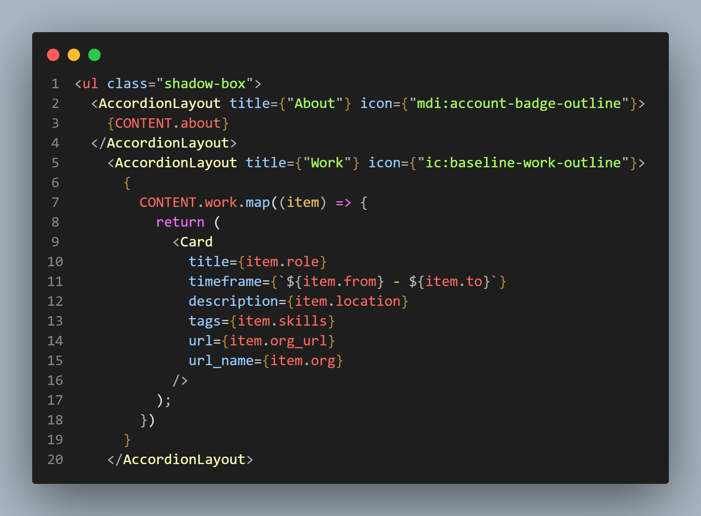

# Astro-Vitae | Personalized CV with minimal efforts



Astro-Vitae is a free, personalized CV template with sleek & minimal design which helps in simplifying the process of getting a CV for yourself. So much so that someone with minimal knowledge of coding can easily get their CV just by updating their details.

## Demo

View a live demo of [Astro-Vitae](https://astro-vitae.vercel.app/)

## Requirements

```
- Git & Github Account
- NPM (Node Package Manager)
- A text-editor
```

## Installation

After cloning and setting up the project files on your local machine, run the following command in your terminal

```bash
npm install
```

Once the packages are installed you are ready to run astro. Astro comes with a built-in development server that has everything you need for project development. The astro dev command will start the local development server so that you can see your new website in action for the very first time.

```bash
npm run dev
```

## Tech Stack

- [Astro](https://astro.build)
- [TailwindCSS](https://tailwindcss.com/)
- [AlpineJs](https://alpinejs.dev/)

## Project Structure

```php
├── src/
│   ├── components/
│   │   ├── Card.astro
│   │   ├── Container.astro
│   │   ├── Footer.astro
│   │   └── Header.astro
│   ├── layouts/
│   │   └── AccordionLayout.astro
│   │   └── BaseLayout.astro
│   └── pages/
│   │   ├── content.js
│   │   └── index.astro
├── public/
│   ├── favicon.svg
│   └── profile.jpg
│   └── screenshot.jpeg
├── astro.config.mjs
├── tailwind.config.cjs
├── package.json
├── README.md
├── .gitignore
└── tsconfig.json
```

## Using & Editing the content

In order to change the content of the CV, all you have to do is update it in the `content.js` file in `/src` folder.



In `src/content.js` all variables contain information that is to be reflected in the UI. In order to change it, simply update the values with your data. The personal information is fairly simple, content for the likes of work, projects, etc are stored as JavaScript objects.

#### Adding or Removing a field

To add or remove a field from the CV, simply go to `Container.astro` in `src/components/`



- To Add a new field, add a new `<AccordionLayout />` component, with appropriate props and child component. Make sure add the data of field in proper format in `content.js`.
- To Remove an already existing field, simply comment out the `<AccordionLayout />` component of that particular field or remove it. Removing its content from `content.js` is a choice.

## Contributing

Suggestions and pull requests are welcomed! Feel free to open a discussion or an [issue](https://github.com/uskhokhar/astro-vitae/issues) for a new feature request or bug.

## License

Astro-Vitae is licensed under the MIT license — see the [LICENSE](https://github.com/uskhokhar/astro-vitae/blob/main/LICENSE) file for details.

## Contributors

<a href="https://github.com/uskhokhar/astro-vitae/graphs/contributors">
  
</a>

Happy Hecking 🙌 